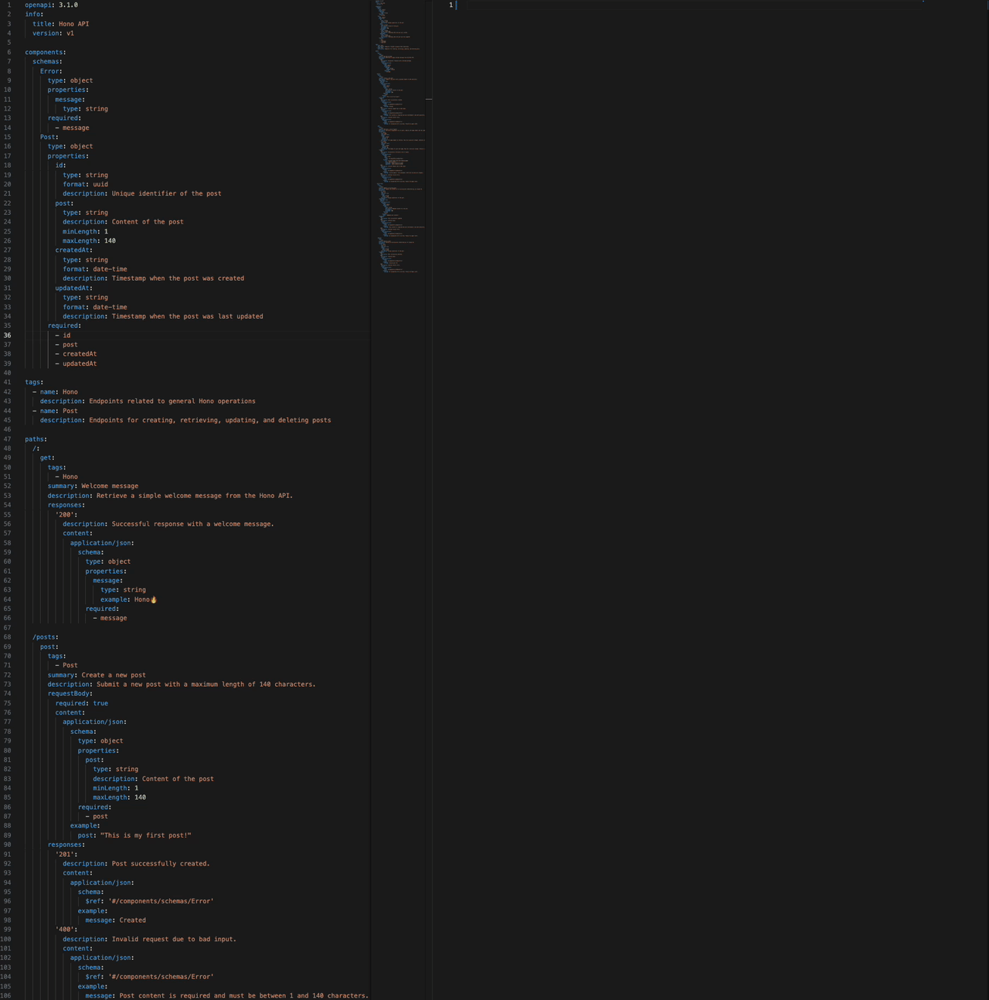

# Hono Takibi



Hono Takibi is a CLI tool that generates Hono routes from OpenAPI specifications.

```bash
npm add -D hono-takibi
```

# Usage

```bash
npx hono-takibi path/to/openapi.yaml -o path/to/output_hono.ts
```

input:

```yaml
openapi: 3.1.0
info:
  title: Hono API
  version: v1

components:
  schemas:
    Error:
      type: object
      properties:
        message:
          type: string
      required:
        - message
    Post:
      type: object
      properties:
        id:
          type: string
          format: uuid
          description: Unique identifier of the post
        post:
          type: string
          description: Content of the post
          minLength: 1
          maxLength: 140
        createdAt:
          type: string
          format: date-time
          description: Timestamp when the post was created
        updatedAt:
          type: string
          format: date-time
          description: Timestamp when the post was last updated
      required:
        - id
        - post
        - createdAt
        - updatedAt

tags:
  - name: Hono
    description: Endpoints related to general Hono operations
  - name: Post
    description: Endpoints for creating, retrieving, updating, and deleting posts

paths:
  /:
    get:
      tags:
        - Hono
      summary: Welcome message
      description: Retrieve a simple welcome message from the Hono API.
      responses:
        '200':
          description: Successful response with a welcome message.
          content:
            application/json:
              schema:
                type: object
                properties:
                  message:
                    type: string
                    example: Hono🔥
                required:
                  - message

  /posts:
    post:
      tags:
        - Post
      summary: Create a new post
      description: Submit a new post with a maximum length of 140 characters.
      requestBody:
        required: true
        content:
          application/json:
            schema:
              type: object
              properties:
                post:
                  type: string
                  description: Content of the post
                  minLength: 1
                  maxLength: 140
              required:
                - post
            example:
              post: "This is my first post!"
      responses:
        '201':
          description: Post successfully created.
          content:
            application/json:
              schema:
                $ref: '#/components/schemas/Error'
              example:
                message: Created
        '400':
          description: Invalid request due to bad input.
          content:
            application/json:
              schema:
                $ref: '#/components/schemas/Error'
              example:
                message: Post content is required and must be between 1 and 140 characters.
        '500':
          description: Internal server error.
          content:
            application/json:
              schema:
                $ref: '#/components/schemas/Error'
              example:
                message: An unexpected error occurred. Please try again later.

    get:
      tags:
        - Post
      summary: Retrieve a list of posts
      description: Retrieve a paginated list of posts. Specify the page number and the number of posts per page.
      parameters:
        - in: query
          name: page
          required: false
          schema:
            type: integer
            minimum: 1
            default: 1
          description: The page number to retrieve. Must be a positive integer. Defaults to 1.
        - in: query
          name: rows
          required: false
          schema:
            type: integer
            minimum: 1
            default: 10
          description: The number of posts per page. Must be a positive integer. Defaults to 10.
      responses:
        '200':
          description: Successfully retrieved a list of posts.
          content:
            application/json:
              schema:
                type: array
                items:
                  $ref: '#/components/schemas/Post'
              example:
                - id: "123e4567-e89b-12d3-a456-426614174000"
                  post: "Hello world!"
                  createdAt: "2024-12-01T12:34:56Z"
                  updatedAt: "2024-12-02T14:20:00Z"
        '400':
          description: Invalid request due to bad input.
          content:
            application/json:
              schema:
                $ref: '#/components/schemas/Error'
              example:
                message: Invalid page or rows parameter. Both must be positive integers.
        '500':
          description: Internal server error.
          content:
            application/json:
              schema:
                $ref: '#/components/schemas/Error'
              example:
                message: An unexpected error occurred. Please try again later.

  /posts/{id}:
    put:
      tags:
        - Post
      summary: Update an existing post
      description: Update the content of an existing post identified by its unique ID.
      parameters:
        - in: path
          name: id
          required: true
          schema:
            type: string
            format: uuid
          description: Unique identifier of the post.
      requestBody:
        required: true
        content:
          application/json:
            schema:
              type: object
              properties:
                post:
                  type: string
                  description: Updated content for the post
                  minLength: 1
                  maxLength: 140
              required:
                - post
            example:
              post: "Updated post content."
      responses:
        '204':
          description: Post successfully updated.
        '400':
          description: Invalid input.
          content:
            application/json:
              schema:
                $ref: '#/components/schemas/Error'
              example:
                message: Post content is required and must be between 1 and 140 characters.
        '500':
          description: Internal server error.
          content:
            application/json:
              schema:
                $ref: '#/components/schemas/Error'
              example:
                message: An unexpected error occurred. Please try again later.

    delete:
      tags:
        - Post
      summary: Delete a post
      description: Delete an existing post identified by its unique ID.
      parameters:
        - in: path
          name: id
          required: true
          schema:
            type: string
            format: uuid
          description: Unique identifier of the post.
      responses:
        '204':
          description: Post successfully deleted.
        '400':
          description: Invalid input.
          content:
            application/json:
              schema:
                $ref: '#/components/schemas/Error'
              example:
                message: Invalid post ID.
        '500':
          description: Internal server error.
          content:
            application/json:
              schema:
                $ref: '#/components/schemas/Error'
              example:
                message: An unexpected error occurred. Please try again later.
```

output:

```ts
import { createRoute, z } from '@hono/zod-openapi'

const errorSchema = z.object({ message: z.string() })

const postSchema = z.object({
  id: z.string().uuid(),
  post: z.string().min(1).max(140),
  createdAt: z.string().datetime(),
  updatedAt: z.string().datetime(),
})

export const schemas = {
  errorSchema,
  postSchema,
}

export const getRoute = createRoute({
  tags: ['Hono'],
  method: 'get',
  path: '/',
  description: 'Retrieve a simple welcome message from the Hono API.',
  responses: {
    200: {
      description: 'Successful response with a welcome message.',
      content: { 'application/json': { schema: z.object({ message: z.string() }) } },
    },
  },
})

export const postPostsRoute = createRoute({
  tags: ['Post'],
  method: 'post',
  path: '/posts',
  description: 'Submit a new post with a maximum length of 140 characters.',
  request: {
    body: {
      required: true,
      content: { 'application/json': { schema: z.object({ post: z.string().min(1).max(140) }) } },
    },
  },
  responses: {
    201: {
      description: 'Post successfully created.',
      content: { 'application/json': { schema: errorSchema } },
    },
    400: {
      description: 'Invalid request due to bad input.',
      content: { 'application/json': { schema: errorSchema } },
    },
    500: {
      description: 'Internal server error.',
      content: { 'application/json': { schema: errorSchema } },
    },
  },
})

export const getPostsRoute = createRoute({
  tags: ['Post'],
  method: 'get',
  path: '/posts',
  description:
    'Retrieve a paginated list of posts. Specify the page number and the number of posts per page.',
  request: {
    query: z.object({
      page: z.string().pipe(z.coerce.number().int().min(0)).optional(),
      rows: z.string().pipe(z.coerce.number().int().min(0)).optional(),
    }),
  },
  responses: {
    200: {
      description: 'Successfully retrieved a list of posts.',
      content: { 'application/json': { schema: z.array(postSchema) } },
    },
    400: {
      description: 'Invalid request due to bad input.',
      content: { 'application/json': { schema: errorSchema } },
    },
    500: {
      description: 'Internal server error.',
      content: { 'application/json': { schema: errorSchema } },
    },
  },
})

export const putPostsIdRoute = createRoute({
  tags: ['Post'],
  method: 'put',
  path: '/posts/{id}',
  description: 'Update the content of an existing post identified by its unique ID.',
  request: {
    body: {
      required: true,
      content: { 'application/json': { schema: z.object({ post: z.string().min(1).max(140) }) } },
    },
    params: z.object({ id: z.string().uuid() }),
  },
  responses: {
    204: { description: 'Post successfully updated.' },
    400: {
      description: 'Invalid input.',
      content: { 'application/json': { schema: errorSchema } },
    },
    500: {
      description: 'Internal server error.',
      content: { 'application/json': { schema: errorSchema } },
    },
  },
})

export const deletePostsIdRoute = createRoute({
  tags: ['Post'],
  method: 'delete',
  path: '/posts/{id}',
  description: 'Delete an existing post identified by its unique ID.',
  request: { params: z.object({ id: z.string().uuid() }) },
  responses: {
    204: { description: 'Post successfully deleted.' },
    400: {
      description: 'Invalid input.',
      content: { 'application/json': { schema: errorSchema } },
    },
    500: {
      description: 'Internal server error.',
      content: { 'application/json': { schema: errorSchema } },
    },
  },
})
```