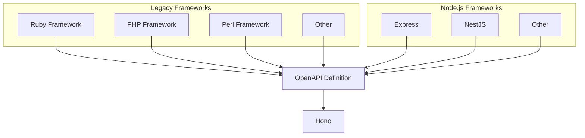
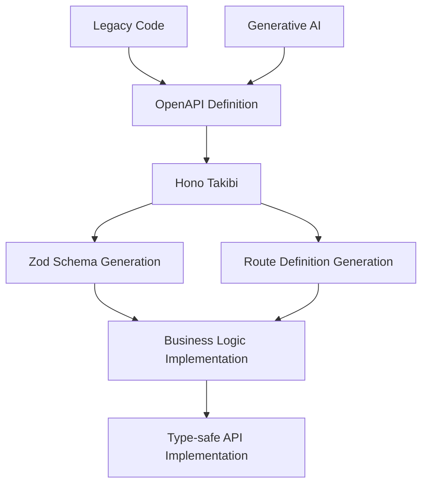

# Purpose

If an **[OpenAPI](https://www.openapis.org/)** definition exists, **[Zod OpenAPI Hono](https://github.com/honojs/middleware/tree/main/packages/zod-openapi)** Hono is effectively ready for use. This project is developed with the goal of automatically generating routine code, allowing developers to focus on implementing business logic.

## Migration to Zod OpenAPI Hono

If your project is looking to migrate, whether from legacy systems or to **[Zod OpenAPI Hono](https://github.com/honojs/middleware/tree/main/packages/zod-openapi)**, and you already have an OpenAPI definition, **[Hono Takibi](https://github.com/nakita628/hono-takibi)** can help make the transition smooth and effortless.

## Development Flow Example

